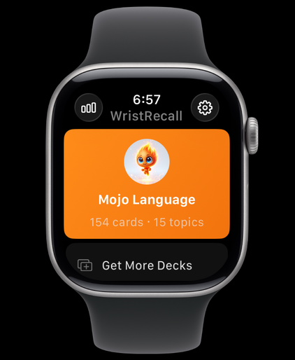
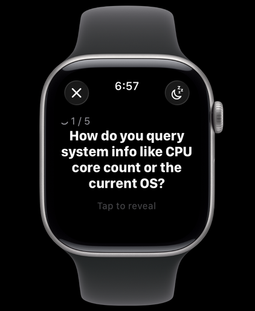
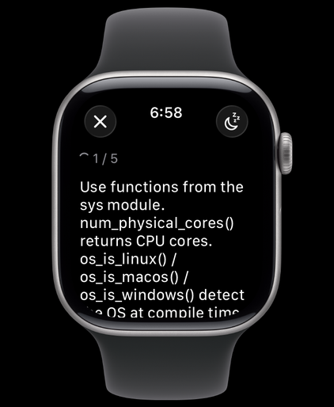
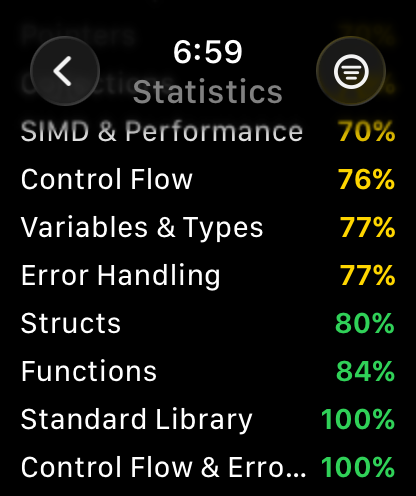
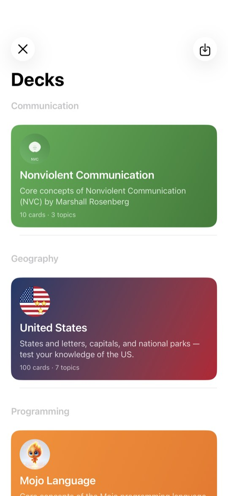
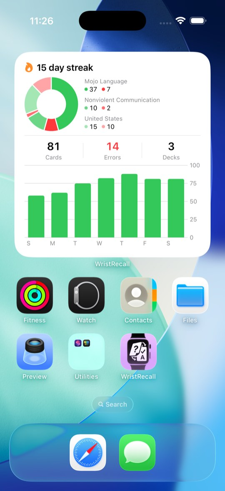
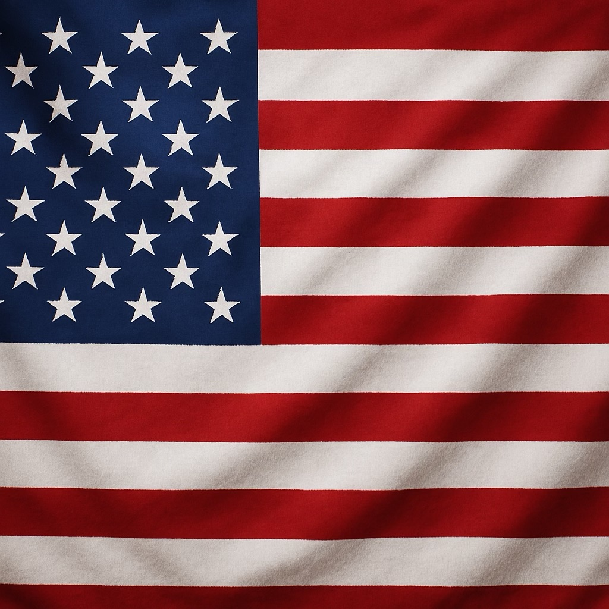
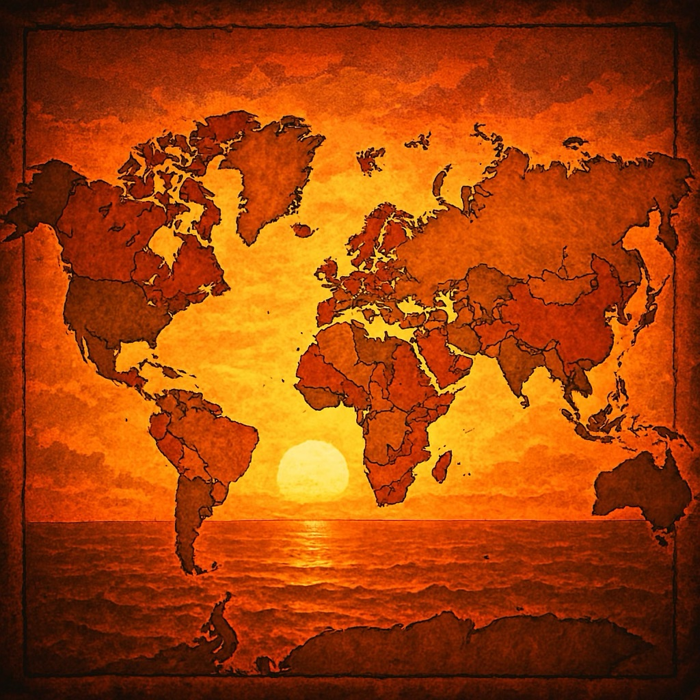

# WristRecall Decks

Community flashcard decks for **[WristRecall](https://apps.apple.com/app/wristrecall/id6760349779)** — the Apple Watch flashcard app.

> *Learn on your wrist. Remember everywhere.*

WristRecall lets you study any subject in quick, focused sessions right on your Apple Watch. This repository hosts ready-to-import `.wristdeck` files for the community, plus everything you need to author and ship your own decks.

[**Get WristRecall on the App Store →**](https://apps.apple.com/app/wristrecall/id6760349779)

---

<table>
  <tr>
    <td align="center" width="20%"></td>
    <td align="center" width="20%"></td>
    <td align="center" width="20%"></td>
    <td align="center" width="20%"></td>
  </tr>
  <tr>
    <td align="center">Pick a deck</td>
    <td align="center">Quick-fire questions</td>
    <td align="center">Tap to reveal</td>
    <td align="center">Track accuracy</td>
  </tr>
</table>

  
  &nbsp;&nbsp;
  

---

## Install a deck

The decks below ship as `.wristdeck` files. To install one on your watch:

1. **On your iPhone**, tap a deck's **Download** link below. WristRecall registers `.wristdeck` files, so iOS will offer to open the file in WristRecall directly.
2. WristRecall imports the deck and shows it in the **Deck Browser**.
3. **Swipe left** on the deck row → tap **Install on Watch**. The deck syncs to your Apple Watch over WatchConnectivity automatically.

> Don't have WristRecall yet? [Get it on the App Store](https://apps.apple.com/app/wristrecall/id6760349779) first — the `.wristdeck` extension is registered by the app, so the import flow only works once it's installed.

If a tap doesn't open WristRecall, save the file to **Files**, open it from there, and choose **Share → WristRecall**.

---

## Available decks

<table>
  <tr>
    <td width="120" align="center"></td>
    <td>
      <strong>Mojo Language</strong> · 165 cards · 15 topics · Programming 
      Core concepts of the <a href="https://docs.modular.com/mojo/">Mojo</a> programming language — functions, value ownership, traits, pointers, metaprogramming, and the standard library. 
      <a href="https://github.com/ObjectivePixel/WristRecall-Decks/releases/download/mojo-language-v1.0.8/mojo-language-1.0.8.wristdeck"><strong>Download v1.0.8 ↓</strong></a> · <a href="https://github.com/ObjectivePixel/WristRecall-Decks/releases?q=mojo-language">All versions</a>
    </td>
  </tr>
  <tr>
    <td width="120" align="center"></td>
    <td>
      <strong>United States</strong> · 100 cards · 7 topics · Geography 
      States and letters, capitals, and national parks — test your knowledge of the US. 
      <a href="https://github.com/ObjectivePixel/WristRecall-Decks/releases/download/us-states-v2.0.2/us-states-2.0.2.wristdeck"><strong>Download v2.0.2 ↓</strong></a> · <a href="https://github.com/ObjectivePixel/WristRecall-Decks/releases?q=us-states">All versions</a>
    </td>
  </tr>
  <tr>
    <td width="120" align="center"></td>
    <td>
      <strong>Countries of the World</strong> · 60 cards · 9 topics · Geography 
      How many countries, continents, oceans, and landmasses make up our world — plus capitals and flags from every region. 
      <a href="https://github.com/ObjectivePixel/WristRecall-Decks/releases/download/world-countries-v1.0.2/world-countries-1.0.2.wristdeck"><strong>Download v1.0.2 ↓</strong></a> · <a href="https://github.com/ObjectivePixel/WristRecall-Decks/releases?q=world-countries">All versions</a>
    </td>
  </tr>
</table>

Each deck is independently versioned in [Releases](https://github.com/ObjectivePixel/WristRecall-Decks/releases).

---

## Want to make your own deck?

Decks are plain JSON plus an optional cover image. Run the bundled `DeckCompiler` and you get a `.wristdeck` file you can share or PR back to this repo.

See **[AUTHORING.md](AUTHORING.md)** — covers the folder layout, the v2 markdown card format (headings, lists, code fences, color callouts), the compile script, and how to contribute your deck.

## License

[MIT](LICENSE).
