# WristRecall Decks

Community flashcard decks for **[WristRecall](https://apps.apple.com/app/wristrecall/id6760349779)** — the Apple Watch flashcard app.

> *Learn on your wrist. Remember everywhere.*

WristRecall lets you study any subject in quick, focused sessions right on your Apple Watch. This repository hosts ready-to-import `.wristdeck` files for the community, plus everything you need to author and ship your own decks.

[**Get WristRecall on the App Store →**](https://apps.apple.com/app/wristrecall/id6760349779)

---

<table>
  <tr>
    <td align="center" width="20%">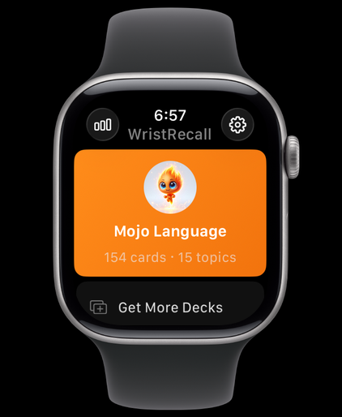</td>
    <td align="center" width="20%">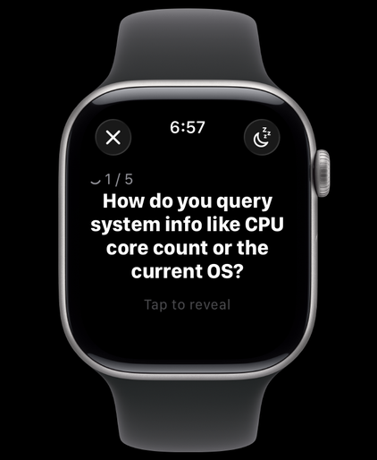</td>
    <td align="center" width="20%">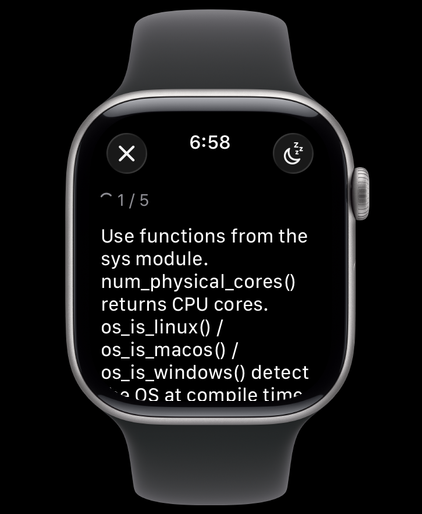</td>
    <td align="center" width="20%">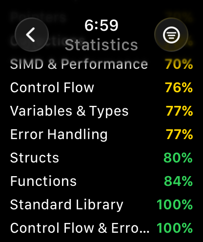</td>
  </tr>
  <tr>
    <td align="center">Pick a deck</td>
    <td align="center">Quick-fire questions</td>
    <td align="center">Tap to reveal</td>
    <td align="center">Track accuracy</td>
  </tr>
</table>

  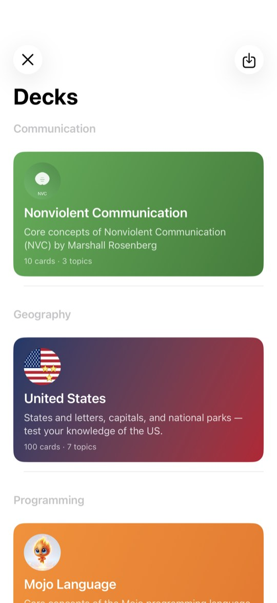
  &nbsp;&nbsp;
  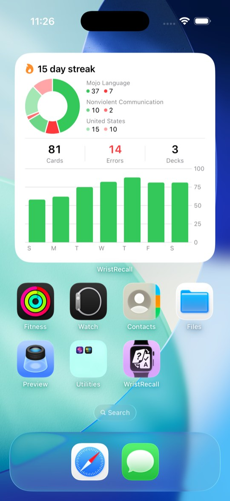
  &nbsp;&nbsp;
  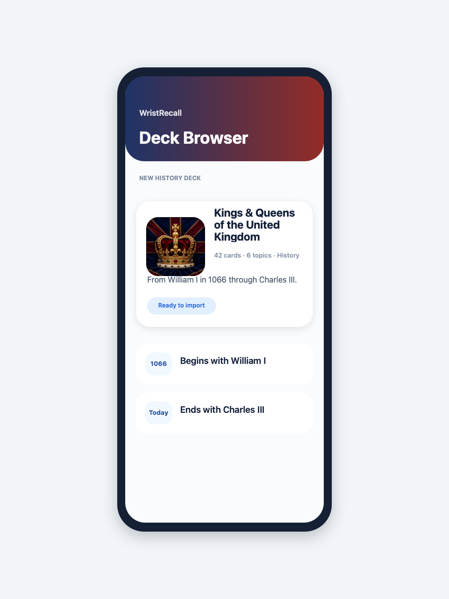

---

## Install a deck

The decks below ship as `.wristdeck` files. To install one on your watch:

1. **On your iPhone**, tap a deck's **Download** link below. WristRecall registers `.wristdeck` files, so iOS will offer to open the file in WristRecall directly.
2. WristRecall imports the deck and shows it in the **Deck Browser**.
3. **Swipe left** on the deck row → tap **Install on Watch**. The deck syncs to your Apple Watch over WatchConnectivity automatically.

> Don't have WristRecall yet? [Get it on the App Store](https://apps.apple.com/app/wristrecall/id6760349779) first — the `.wristdeck` extension is registered by the app, so the import flow only works once it's installed.

If a tap doesn't open WristRecall, save the file to **Files**, open it from there, and choose **Share → WristRecall**.

---

## Available decks

<table>
  <tr>
    <td width="120" align="center">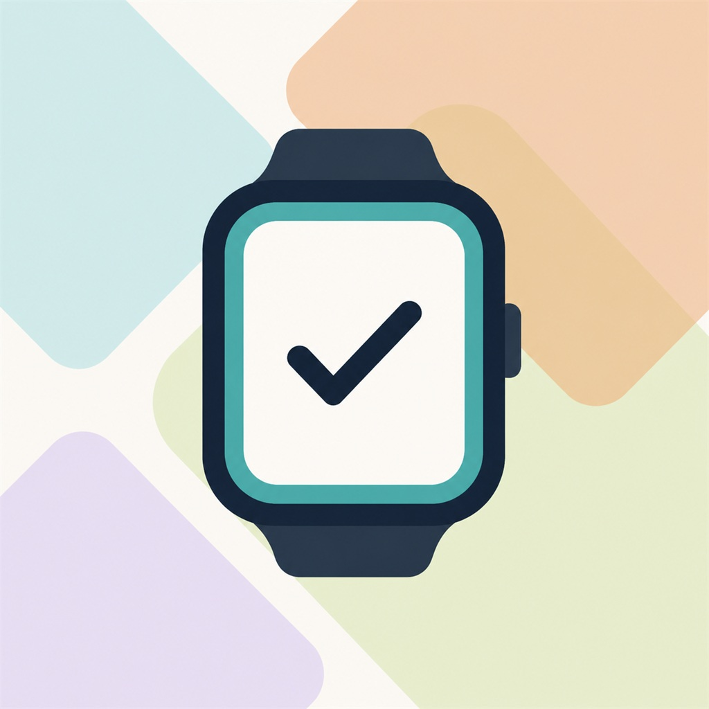</td>
    <td>
      <strong>Welcome to WristRecall</strong> · 10 cards · 3 topics · Getting Started 
      Learn how to use WristRecall in ten quick cards — your wrist, your decks, your daily streak. 
      <a href="https://github.com/ObjectivePixel/WristRecall-Decks/releases/download/welcome-v1.0.2/welcome-1.0.2.wristdeck"><strong>Download v1.0.2 ↓</strong></a> · <a href="https://github.com/ObjectivePixel/WristRecall-Decks/releases?q=welcome">All versions</a>
    </td>
  </tr>
  <tr>
    <td width="120" align="center">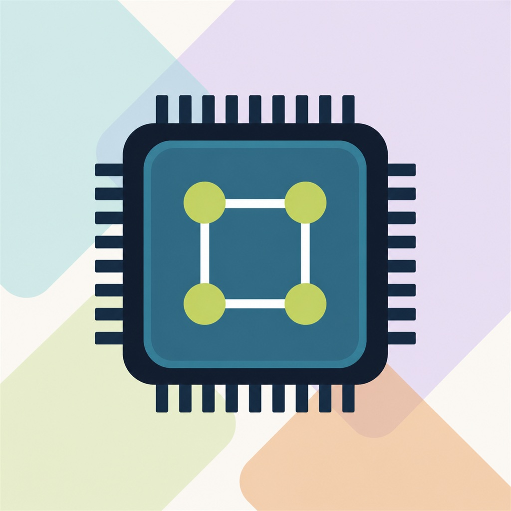</td>
    <td>
      <strong>AI Terms</strong> · 74 cards · 6 topics · Programming 
      Essential AI, ML, and GPU-computing terminology — for the <a href="https://www.modular.com/">Mojo / Modular</a> ecosystem. 
      <a href="https://github.com/ObjectivePixel/WristRecall-Decks/releases/download/ai-terms-v0.1.4/ai-terms-0.1.4.wristdeck"><strong>Download v0.1.4 ↓</strong></a> · <a href="https://github.com/ObjectivePixel/WristRecall-Decks/releases?q=ai-terms">All versions</a>
    </td>
  </tr>
  <tr>
    <td width="120" align="center"></td>
    <td>
      <strong>Mojo Language</strong> · 180 cards · 15 topics · Programming 
      Core concepts of the <a href="https://docs.modular.com/mojo/">Mojo</a> programming language — functions, value ownership, traits, pointers, metaprogramming, and the standard library. 
      <a href="https://github.com/ObjectivePixel/WristRecall-Decks/releases/download/mojo-language-v1.1.3/mojo-language-1.1.3.wristdeck"><strong>Download v1.1.3 ↓</strong></a> · <a href="https://github.com/ObjectivePixel/WristRecall-Decks/releases?q=mojo-language">All versions</a>
    </td>
  </tr>
  <tr>
    <td width="120" align="center">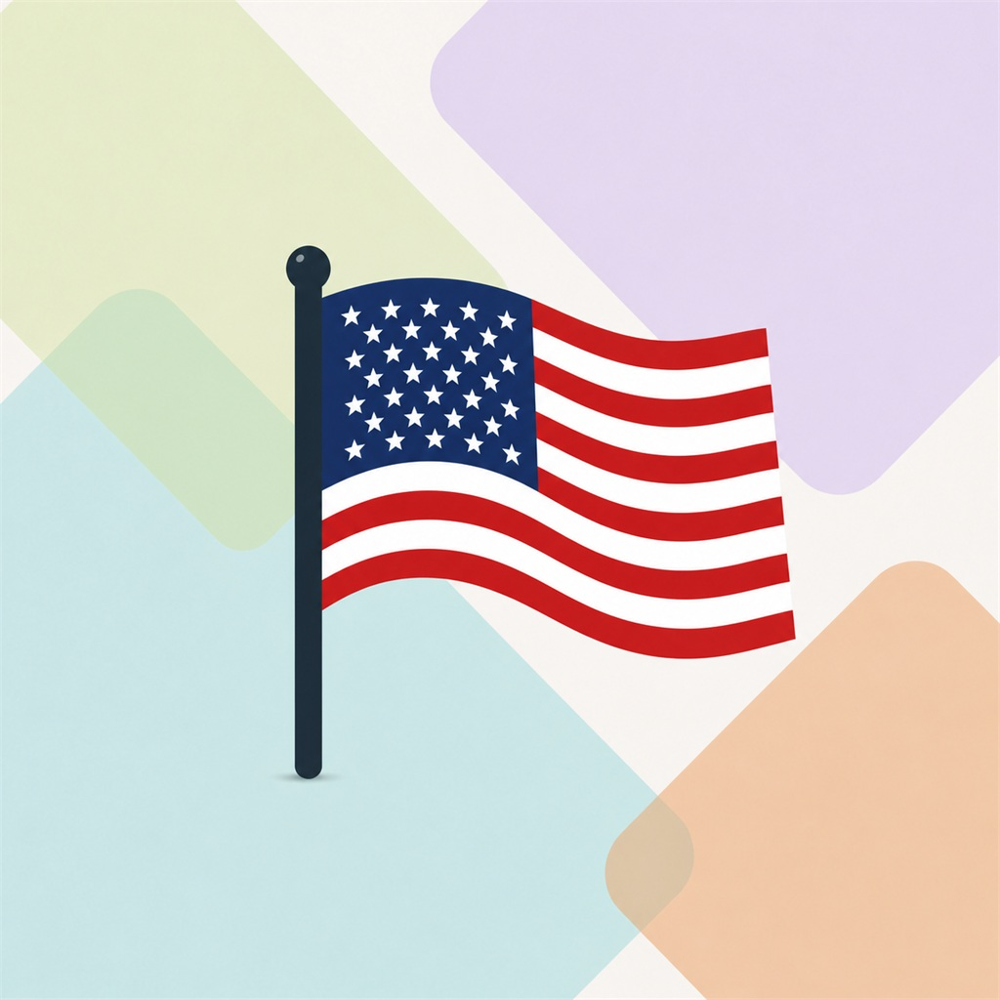</td>
    <td>
      <strong>United States</strong> · 100 cards · 7 topics · Geography 
      States and letters, capitals, and national parks — test your knowledge of the US. 
      <a href="https://github.com/ObjectivePixel/WristRecall-Decks/releases/download/us-states-v2.0.4/us-states-2.0.4.wristdeck"><strong>Download v2.0.4 ↓</strong></a> · <a href="https://github.com/ObjectivePixel/WristRecall-Decks/releases?q=us-states">All versions</a>
    </td>
  </tr>
  <tr>
    <td width="120" align="center">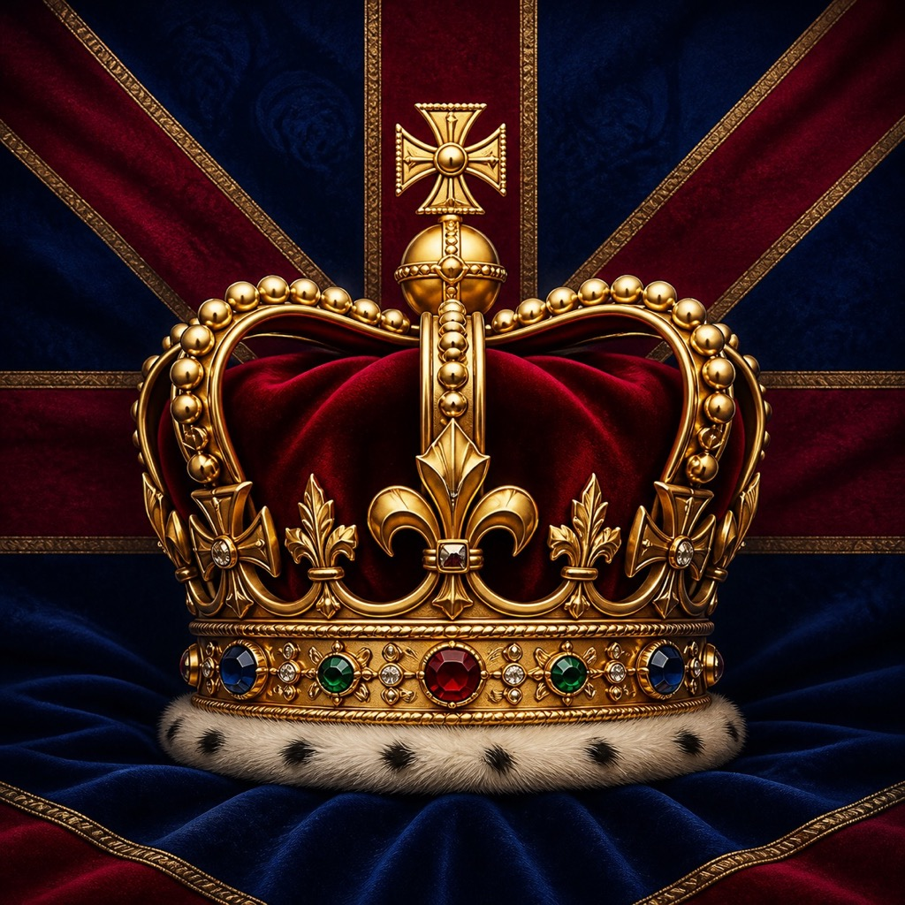</td>
    <td>
      <strong>Kings &amp; Queens of the United Kingdom</strong> · 42 cards · 6 topics · History 
      A chronological walk through every monarch of England and the United Kingdom from William I in 1066 through Charles III. 
      <a href="https://github.com/ObjectivePixel/WristRecall-Decks/releases/download/kings-and-queens-of-the-united-kingdom-v1.0.0/kings-and-queens-of-the-united-kingdom-1.0.0.wristdeck"><strong>Download v1.0.0 ↓</strong></a> · <a href="https://github.com/ObjectivePixel/WristRecall-Decks/releases?q=kings-and-queens-of-the-united-kingdom">All versions</a>
    </td>
  </tr>
  <tr>
    <td width="120" align="center">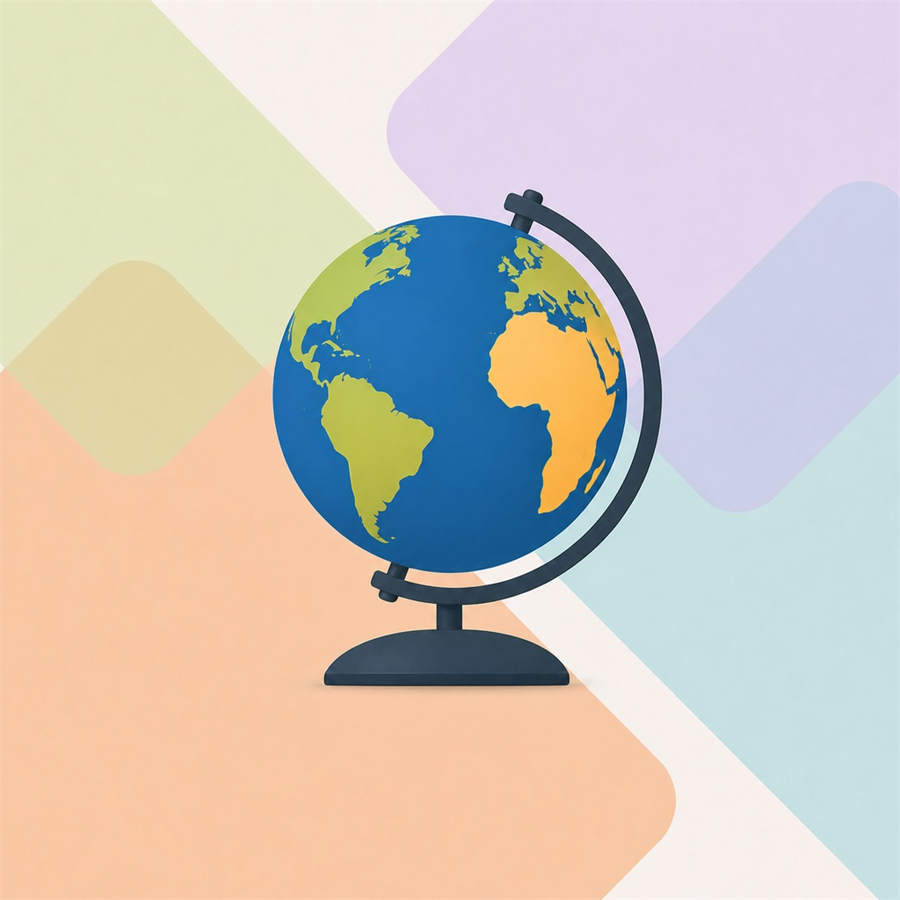</td>
    <td>
      <strong>Countries of the World</strong> · 60 cards · 9 topics · Geography 
      How many countries, continents, oceans, and landmasses make up our world — plus capitals and flags from every region. 
      <a href="https://github.com/ObjectivePixel/WristRecall-Decks/releases/download/world-countries-v1.0.4/world-countries-1.0.4.wristdeck"><strong>Download v1.0.4 ↓</strong></a> · <a href="https://github.com/ObjectivePixel/WristRecall-Decks/releases?q=world-countries">All versions</a>
    </td>
  </tr>
  <tr>
    <td width="120" align="center">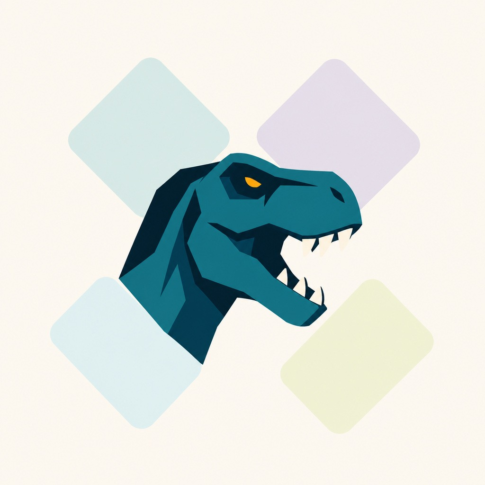</td>
    <td>
      <strong>Dinosaurs</strong> · 92 cards · 7 topics · Science 
      Meet iconic dinosaurs and explore their groups, adaptations, times, and world. 
      <a href="https://github.com/ObjectivePixel/WristRecall-Decks/releases/download/dinosaurs-v1.0.0/dinosaurs-1.0.0.wristdeck"><strong>Download v1.0.0 ↓</strong></a> · <a href="https://github.com/ObjectivePixel/WristRecall-Decks/releases?q=dinosaurs">All versions</a>
    </td>
  </tr>
  <tr>
    <td width="120" align="center"></td>
    <td>
      <strong>Famous Figures in History</strong> · 113 cards · 9 topics · History 
      107 influential people — and the ideas, discoveries, art, leadership, and movements that shaped world history. 
      <a href="https://github.com/ObjectivePixel/WristRecall-Decks/releases/download/famous-figures-history-v1.0.1/famous-figures-history-1.0.1.wristdeck"><strong>Download v1.0.1 ↓</strong></a> · <a href="https://github.com/ObjectivePixel/WristRecall-Decks/releases?q=famous-figures-history">All versions</a>
    </td>
  </tr>
  <tr>
    <td width="120" align="center"></td>
    <td>
      <strong>Famous Movie Quotes</strong> · 50 cards · 3 topics · Entertainment 
      Fifty lines every film fan should know, graded easy to hard — each with the film, the year, and a little context. 
      <a href="https://github.com/ObjectivePixel/WristRecall-Decks/releases/download/famous-movie-quotes-v1.1.0/famous-movie-quotes-1.1.0.wristdeck"><strong>Download v1.1.0 ↓</strong></a> · <a href="https://github.com/ObjectivePixel/WristRecall-Decks/releases?q=famous-movie-quotes">All versions</a>
    </td>
  </tr>
  <tr>
    <td width="120" align="center">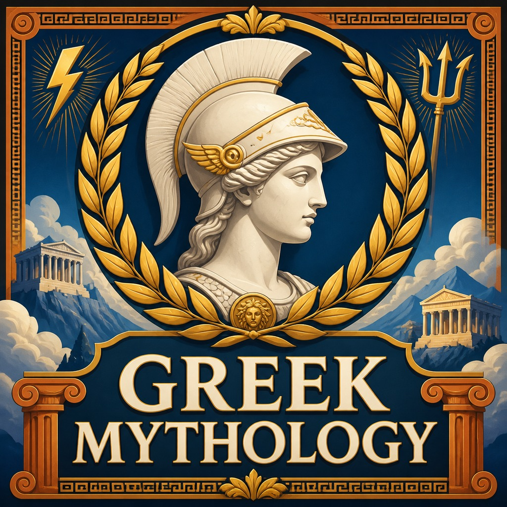</td>
    <td>
      <strong>Greek Mythology</strong> · 100 cards · 6 topics · History &amp; Culture 
      Gods, heroes, monsters, and the great myths of ancient Greece — from beginner essentials to deeper connections. 
      <a href="https://github.com/ObjectivePixel/WristRecall-Decks/releases/download/greek-mythology-v1.0.0/greek-mythology-1.0.0.wristdeck"><strong>Download v1.0.0 ↓</strong></a> · <a href="https://github.com/ObjectivePixel/WristRecall-Decks/releases?q=greek-mythology">All versions</a>
    </td>
  </tr>
  <tr>
    <td width="120" align="center"></td>
    <td>
      <strong>Major Events in World History</strong> · 75 cards · 6 topics · History 
      A chronological overview of the events and turning points that shaped our world, from the ancient world to the modern day. 
      <a href="https://github.com/ObjectivePixel/WristRecall-Decks/releases/download/major-events-world-history-v1.0.0/major-events-world-history-1.0.0.wristdeck"><strong>Download v1.0.0 ↓</strong></a> · <a href="https://github.com/ObjectivePixel/WristRecall-Decks/releases?q=major-events-world-history">All versions</a>
    </td>
  </tr>
  <tr>
    <td width="120" align="center">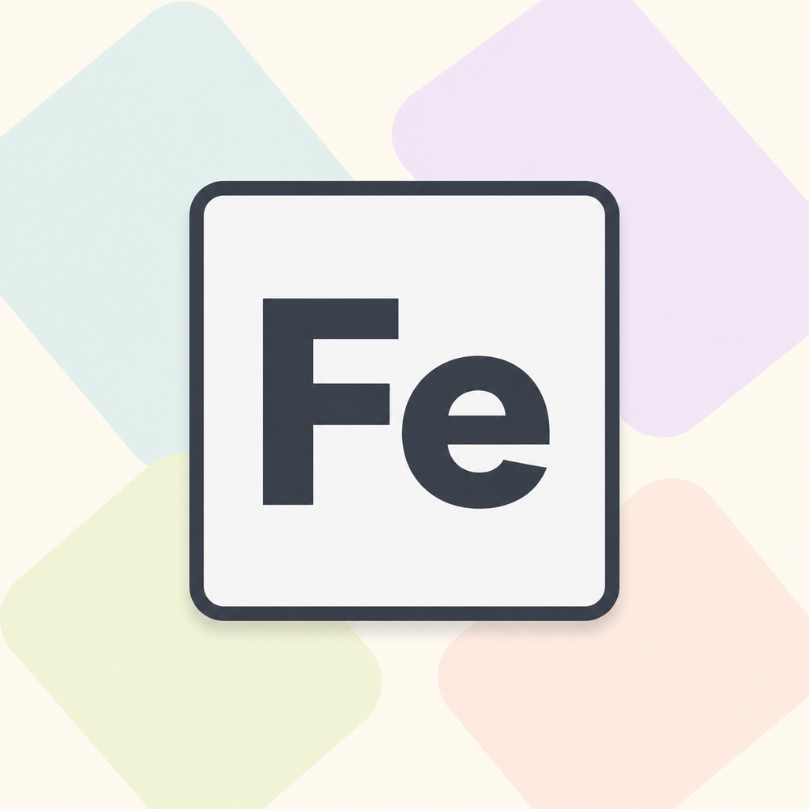</td>
    <td>
      <strong>Periodic Table</strong> · 118 cards · 7 topics · Science 
      Every chemical element and its symbol, walked through period by period. 
      <a href="https://github.com/ObjectivePixel/WristRecall-Decks/releases/download/periodic-table-v1.0.0/periodic-table-1.0.0.wristdeck"><strong>Download v1.0.0 ↓</strong></a> · <a href="https://github.com/ObjectivePixel/WristRecall-Decks/releases?q=periodic-table">All versions</a>
    </td>
  </tr>
  <tr>
    <td width="120" align="center">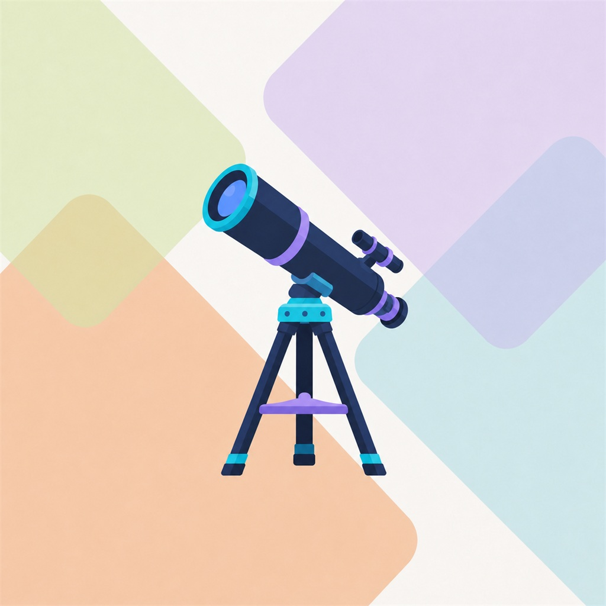</td>
    <td>
      <strong>Space &amp; Astronomy</strong> · 106 cards · 6 topics · Science 
      Explore worlds, stars, galaxies, cosmic extremes, and humanity's journey into space. 
      <a href="https://github.com/ObjectivePixel/WristRecall-Decks/releases/download/space-astronomy-v1.0.0/space-astronomy-1.0.0.wristdeck"><strong>Download v1.0.0 ↓</strong></a> · <a href="https://github.com/ObjectivePixel/WristRecall-Decks/releases?q=space-astronomy">All versions</a>
    </td>
  </tr>
</table>

Each deck is independently versioned in [Releases](https://github.com/ObjectivePixel/WristRecall-Decks/releases).

---

## Want to make your own deck?

Decks are plain JSON plus an optional cover image. Run the bundled `DeckCompiler` and you get a `.wristdeck` file you can share or PR back to this repo.

See **[AUTHORING.md](AUTHORING.md)** — covers the folder layout, the markdown card format (headings, lists, code fences, color callouts), the compile script, and how to contribute your deck.

## License

[MIT](LICENSE).
